# DASHBOOK APPLICATION
###### Smart Bookmarks with Tiny URL

## Tech Stack


**Front End**
- Angular 10
- Angular Material 10
- Bootstap V4
- Node 6

**Back End**
- OpenJDK 11
- Maven Utils
- Spring Boot
- JOOQ
- Flyway
- JWT Security
- Swagger Open API

**DBMS**
- MySQL
- AWS RDS

**CI/CD Pipeline**
- Docker Container
- GIT SCM
- TRAVIS CI
- AWS Elastic BeanStalk Service

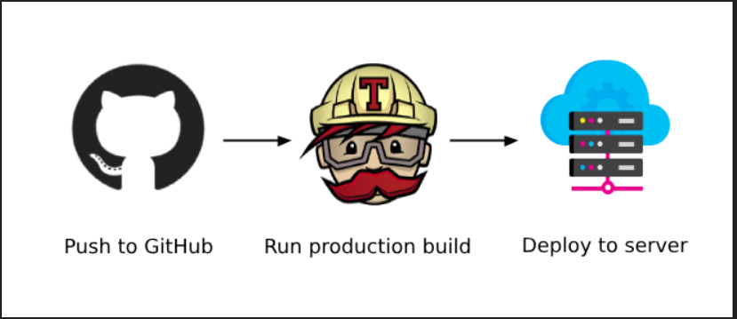

## Running the Backend

To run the backend server locally, you'll need the following prerequisites installed:

*   **Java 11:** Make sure you have JDK 11 installed.
*   **Maven:** Apache Maven is used for building and managing the project.

There are two primary ways to run the backend:

### 1. Using Maven Spring Boot Plugin

This is the simplest way to run the application during development:

```bash
mvn spring-boot:run
```

The application will start, and by default, it will be accessible at `http://localhost:8080`.

### 2. Using the Packaged JAR

First, you need to package the application into an executable JAR file:

```bash
mvn package
```

Once the packaging is successful, you will find the JAR file in the `target` directory (e.g., `target/dashbook-api-0.0.1-SNAPSHOT.jar`). You can run it using:

```bash
java -jar target/dashbook-api-0.0.1-SNAPSHOT.jar
```

The application will start and be accessible at `http://localhost:8080`.

### Database Configuration

The application requires a MySQL database to function.

*   The default database connection details are configured in `src/main/resources/application.properties` and point to an AWS RDS instance: `jdbc:mysql://database-2.ciebyho9uvwj.ap-south-1.rds.amazonaws.com/dashbook`.
*   **Important:** If you do not have access to this specific RDS instance or prefer to use a local MySQL server, you will need to:
    1.  Ensure your MySQL server is running.
    2.  Create a database (e.g., `dashbook`).
    3.  Update the `spring.datasource.url`, `spring.datasource.username`, and `spring.datasource.password` properties in `src/main/resources/application.properties` to point to your local database.
*   The application uses Flyway for database migrations. Upon startup, Flyway will automatically attempt to migrate the database schema to the required version if it can successfully connect to the database specified in `application.properties`.

****

There are many relations logical relations between different moving parts of the application.
RDBMS seems logical choice. Here is dabase schema for the same:


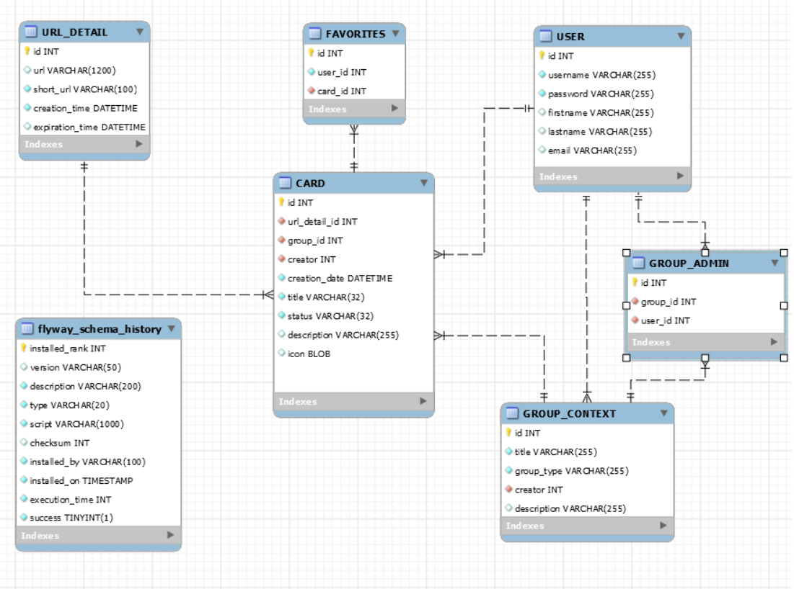

With the help of Angular Material the UI is intuitive and lucid.
The user can generate quick Tiny URL without login, here is an snippet for the same:

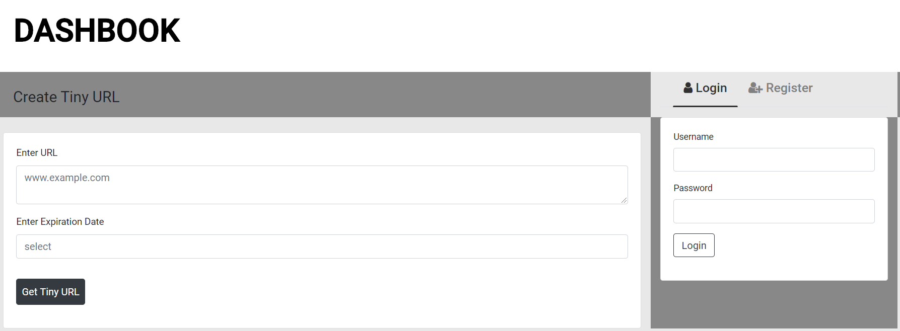

Login redirects to the personalized home page:

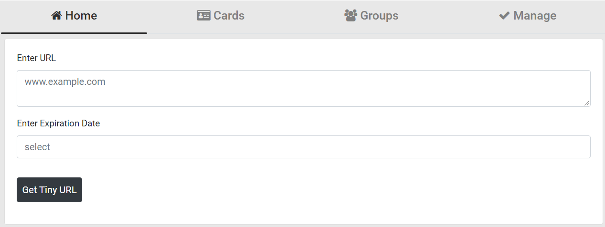

User can view all the cards under this screen, can edit fow which the user has got authority with a single click and can filter his favorites cards for a more personalised experince. 
Thanks to Angular, all this works in real time-

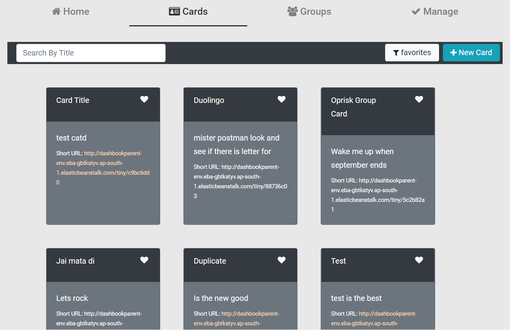

The user can trigger quick action just by clicking on card button-

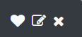

The clicks are minimized. Delete has no popup, its provided where necessary. Here is a sample for Edit Card-

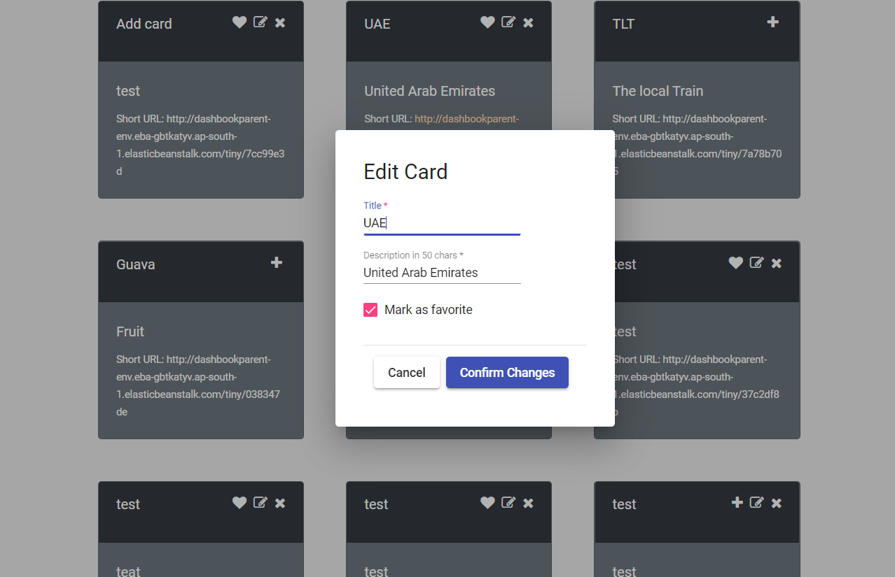

The Cards page show all the Cards, but what if user wants to view cards only belonging to a particaular domain. Groups got them covered. User can filter groups for which user has admin privilege.

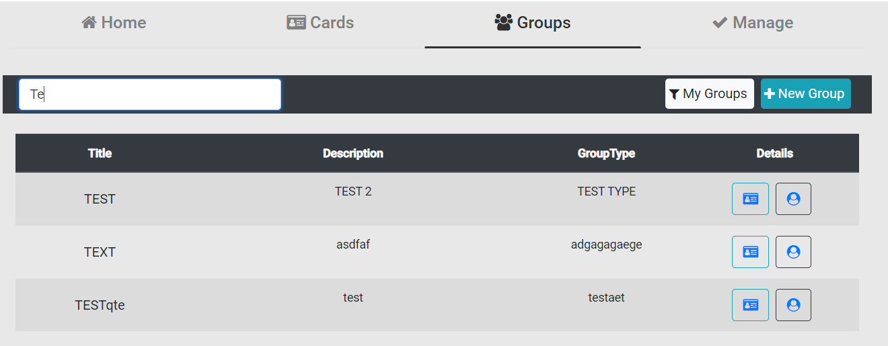

The buttons below will route to two useful views, cards in a group and admins of the group-

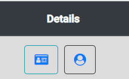

The cards is a group provides with filter all cards with group info. 
Admin user can edit the group information and add or remove card to this group with New Card button.

The backend is well versed with Swagger

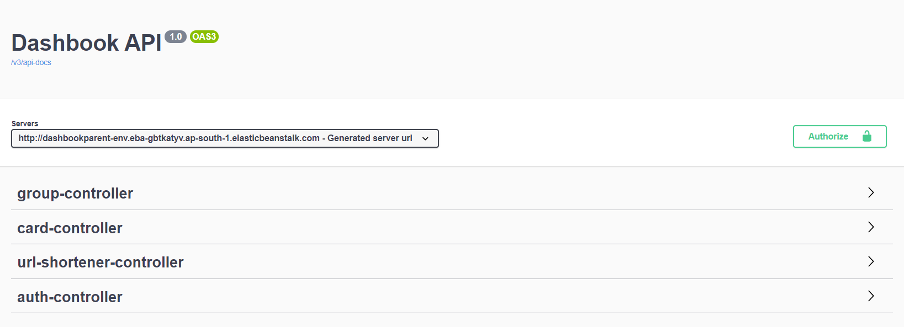

Here is a sample controller:

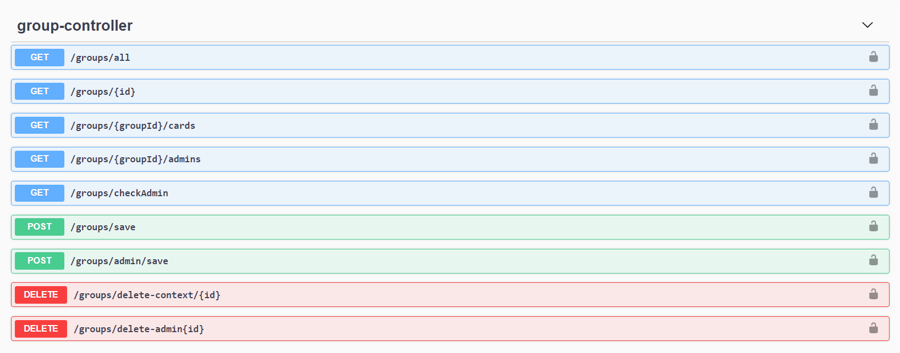

Here is a sample response object:

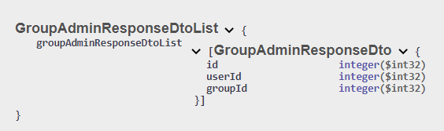


